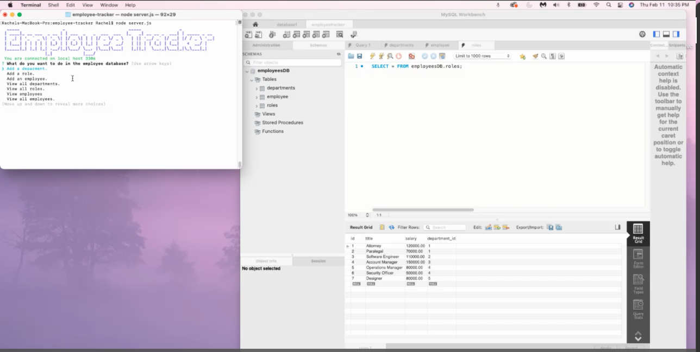
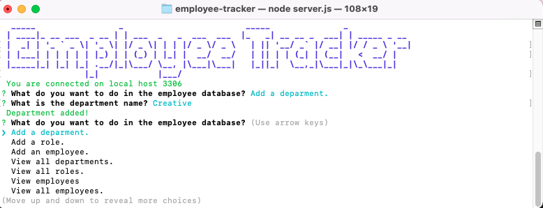
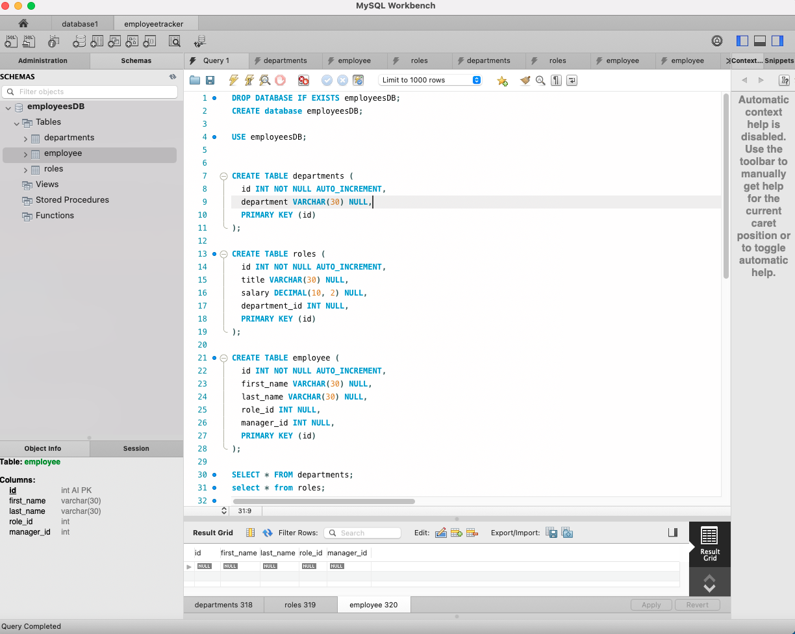
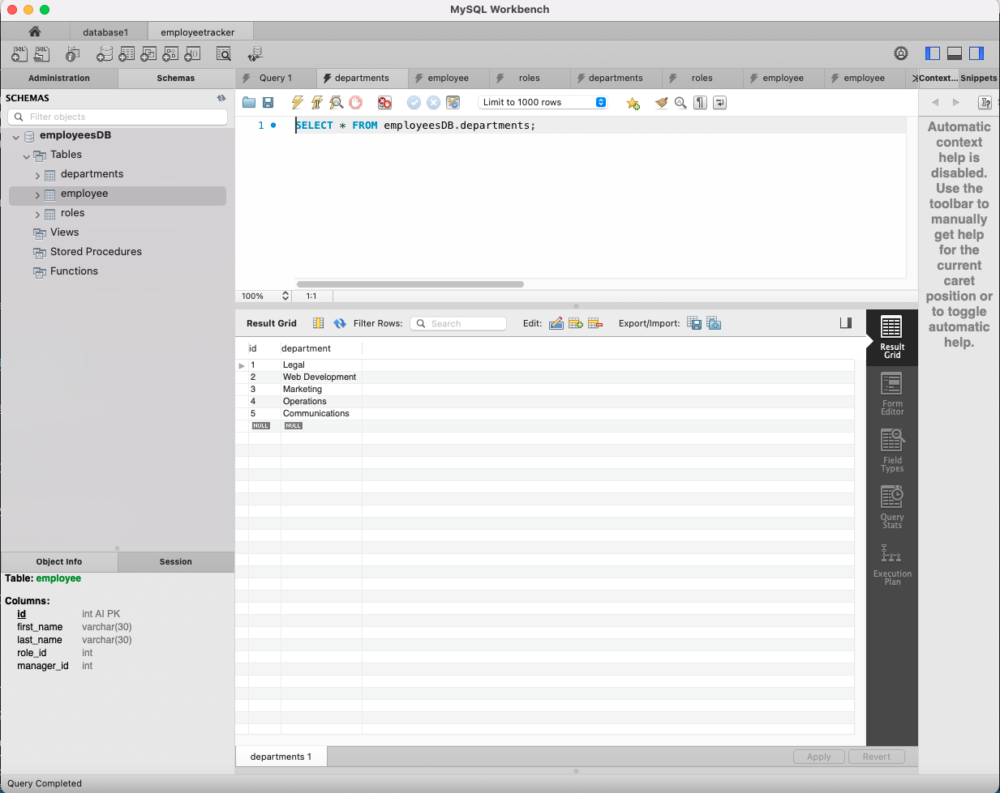
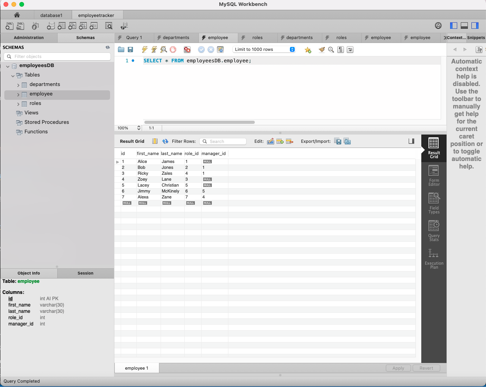
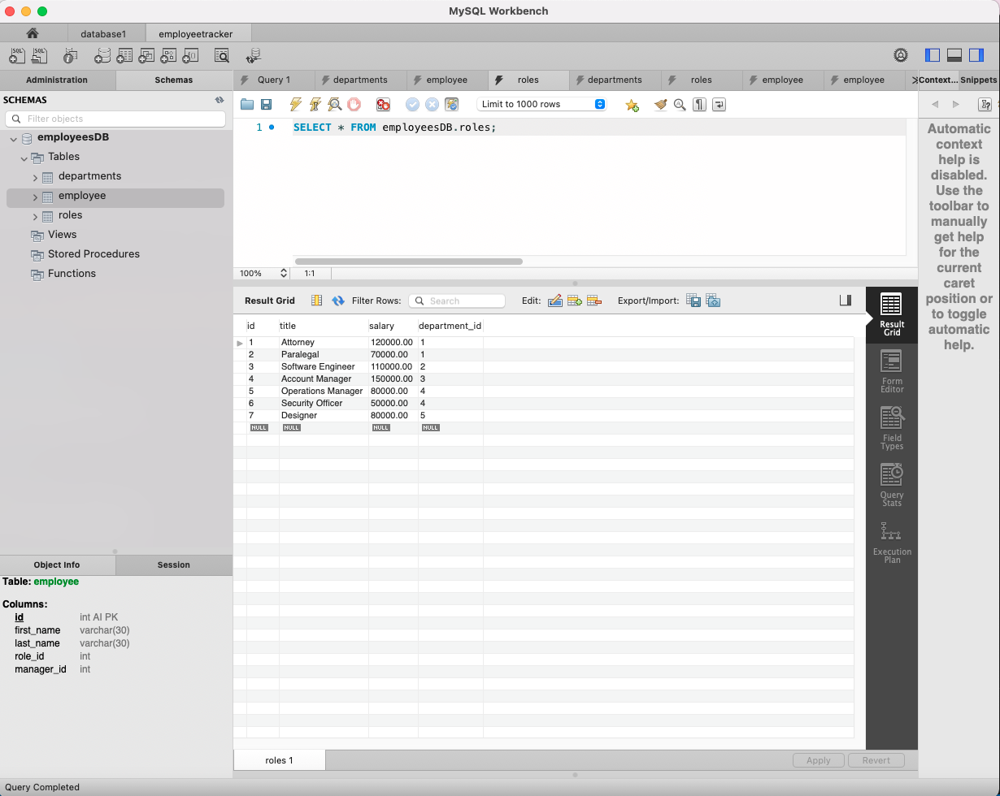

# Employee Tracker 

## Description

This application runs through prompts to create a database of employees, their roles and the departments they belong to for a company. The application is run through the terminal using inqurier and mysql along with figlet and chalk for adding some color. While running the application you will be using the MySql workbench to trach the changes to the database you are making.  

 

## Installation and Instructions

        1. Load Packages:

            npm init

        2. Run Application:

            node server.js
 

## Requirements

        1. Install Dependencies:

            npm install mysql
            npm install inquirer
            npm install figlet
            npm install chalk

        2. Database:

            Install latest version of MySql and MySql Workbench.

 

## Video Walkthrough:
 

 

## Screenshots of terminal prompts:
 

 

## Screenshot of MySql Schema:
 

 

 

 

## Link to repository:

https://github.com/rwanke14/employee-tracker

 

## Additional sources:

Also worked with my study group to better understand how to apply what we learned in class to this readme. Note: Some code may look similar since we generally come out these thinking in the same ways. 

Feedback, brainstorming, and general support to study group:

        1. Young Ji Kim - https://github.com/youjmi
        2. Amir Ashtiany - https://github.com/Alexfit4
        3. Johnnie Simpson - https://github.com/balokdecoy
        5. Frankie Rosado - https://github.com/Franciscorosado09
